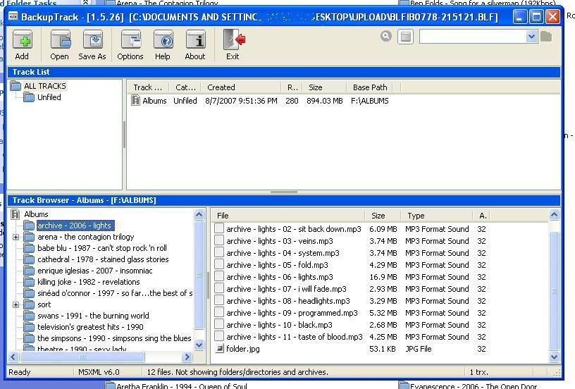



## BackupTrack

### Description

BackupTrack creates an XML based representation of CD's DVD's and Computer Directories. It can also scan RAR and ZIP files and extract their file listings. Use BackupTrack as a powerful tool to handle, track, search and explore your Backup Discs.

BT uses XML so it does not need any MS access dependancy. It has been designed to run on a XP machine.

BT uses the ZLIB compression libraries. Using this enables 30 + MB XML files to be packed into a few KB's which makes BT very portable.

All dependancies are "stored" in the resource file. This means that BT literally "Installs" itself everytime it is run...all this to ensure that you can track your discs wherever you go.

Join me in taking this application to freeware level. Comments and feedback, Bugs (I know there may be several hundred!) are greatly appreciated.
 
### More Info
 
Over a period of time, while managing several DVD's or large file-systems, the large XML database may take a while to load. This makes BT a bit slow to start and close.

             |
---                |---
**Submitted On**   |2007-07-30 14:41:54
**By**             |[Shelz](https://github.com/Planet-Source-Code/PSCIndex/blob/master/ByAuthor/shelz.md)
**Level**          |Intermediate
**User Rating**    |5.0 (25 globes from 5 users)
**Compatibility**  |VB 6\.0
**Category**       |[Complete Applications](https://github.com/Planet-Source-Code/PSCIndex/blob/master/ByCategory/complete-applications__1-27.md)
**World**          |[Visual Basic](https://github.com/Planet-Source-Code/PSCIndex/blob/master/ByWorld/visual-basic.md)
**Archive File**   |[BackupTrac207861872007\.zip](https://github.com/Planet-Source-Code/shelz-backuptrack__1-69113/archive/master.zip)

